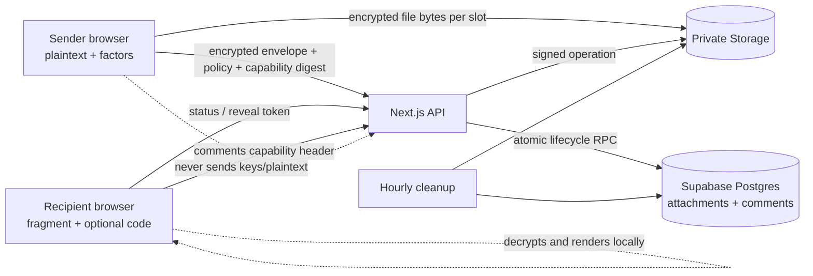
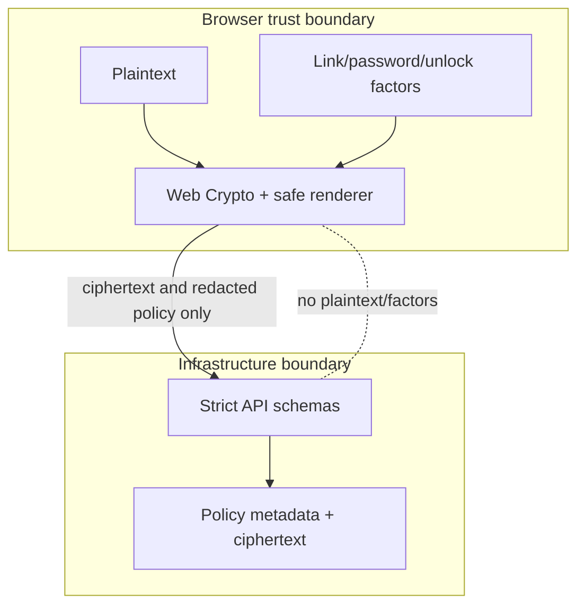

# SecureBin architecture diagrams

These diagrams are intentionally standalone so a judge can understand the
trust boundaries without reading implementation code. They describe the
versioned protocol in [`architecture.md`](architecture.md); a diagram is not
evidence that an unimplemented component has shipped.

## Current implementation coverage

The Day 1–5 surface is implemented and tested: browser-encrypted text plus Markdown/code modes with SBCT v2 framing (including the SBCT `0x02` discussion-capability trailer), password and two-channel unlock factors, up to five encrypted attachments per share through private Storage (slot-staged reservations, signed uploads, size verification, signed 60-second reveal downloads, safe local previews, Download-all ZIP), custom reveal counts, "Never" expiry, append-only encrypted discussions gated by a capability digest and share lifecycle, scheduled cleanup of expired shares, abandoned reservations, and rotated upload paths. The production host redeploy of the newest migrations remains an owner step; see [`PRODUCTION-INCIDENT.md`](PRODUCTION-INCIDENT.md) for the closed incident record.

## System context and data boundary



The fragment secret never becomes an HTTP request field, and the raw discussion capability reaches the server only as a digest at creation or inside a request header thereafter; the API sees only public IDs, ciphertext/envelope data, digests, and the minimum policy metadata required to enforce availability and reveal authorization.

The UI explains this boundary with a restrained proofline: browser → sealed
parcel → recipient. In the diagrams below that visual language is explanatory
only; it is not a protocol message, a cryptographic proof, or evidence that a
reveal was successfully decrypted. The actual boundary remains the one shown
by the solid and dotted data-flow arrows.

## Create and reveal sequence

```mermaid
sequenceDiagram
  participant B as Browser
  participant A as API
  participant D as Atomic database function
  participant S as Private Storage
  B->>B: Generate ID, link secret, factors, nonce, envelope
  opt Encrypted attachments (up to 5 slots)
    B->>A: Reserve random object path per slot
    A->>D: Store reservation digest, size, slot
    A-->>B: Signed upload operation
    B->>S: Upload encrypted bytes
  end
  B->>A: Create share with ciphertext and policy (+ capability digest)
  A->>D: Validate and insert idempotently; attach slots
  A-->>B: Public ID and normalized policy
  B->>A: Status, then explicit reveal confirmation
  A->>D: Lock, validate lifecycle, create/reuse reveal lease
  D-->>A: Ciphertext and attachment paths
  A-->>B: Ciphertext and short-lived file operations (files[])
  B->>B: Derive, authenticate, decrypt, sanitize/render
  opt Discussion enabled
    B->>A: Post/list comments with capability header
    A->>D: Verify digest + lifecycle, rate-limit, append/read
  end
```

## Trust boundaries



The rendered product keeps this boundary legible with plain status copy and
accessible structure. It uses a light-first, warm evidence-desk visual system
with bundled fonts and no remote assets on secret routes; it does not use
terminal, matrix, neon, or shield/lock motifs as a substitute for security
evidence.
