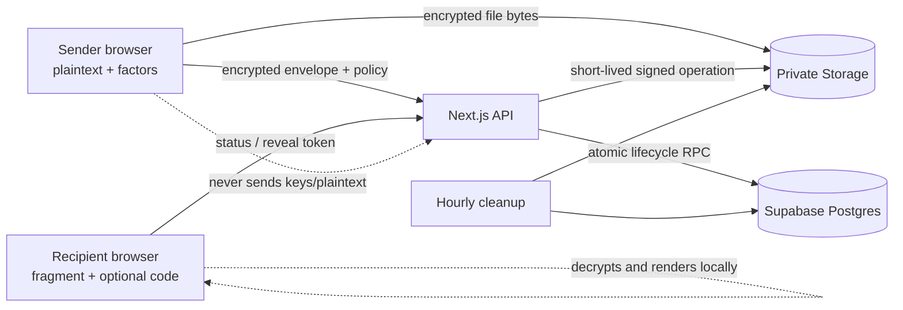
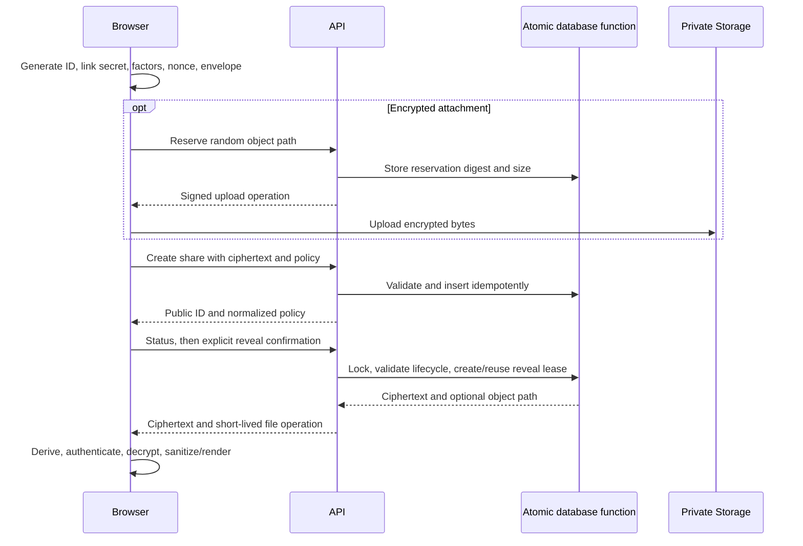
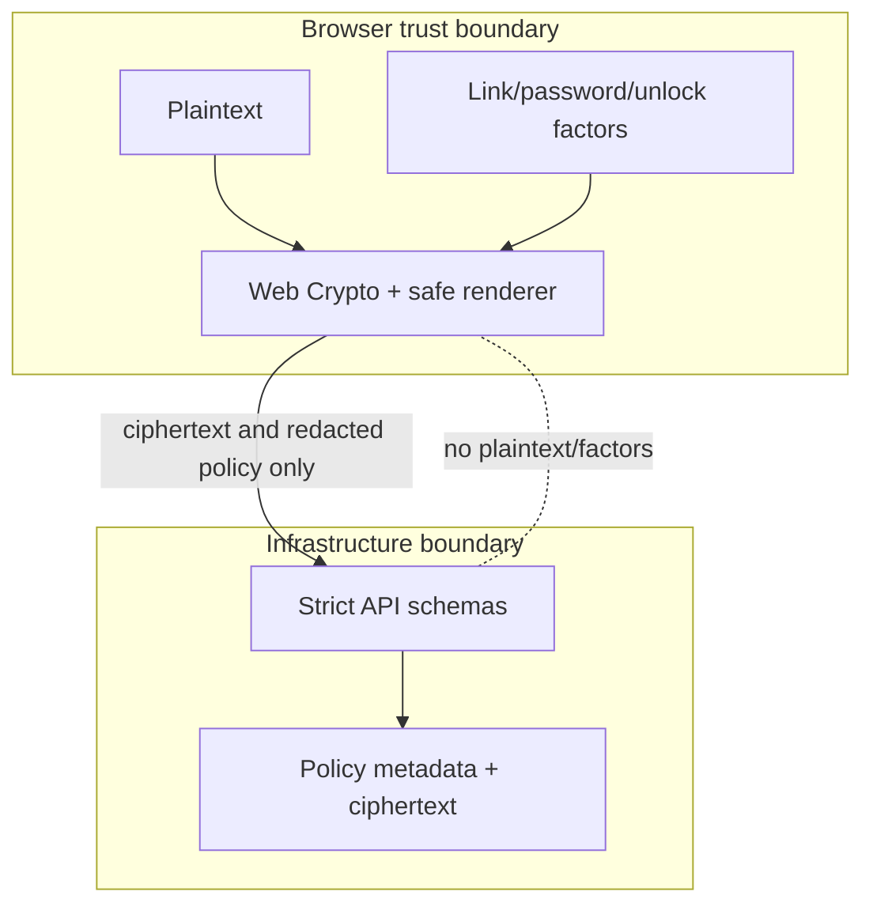

# SecureBin architecture diagrams

These diagrams are intentionally standalone so a judge can understand the
trust boundaries without reading implementation code. They describe the
versioned protocol in [`architecture.md`](architecture.md); a diagram is not
evidence that an unimplemented component has shipped.

## System context and data boundary

The fragment secret never becomes an HTTP request field. The API sees only the
public ID, ciphertext/envelope data, and the minimum policy metadata required
to enforce availability and reveal authorization.

## Create and reveal sequence

## Trust boundaries

