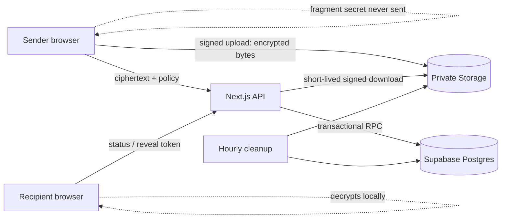
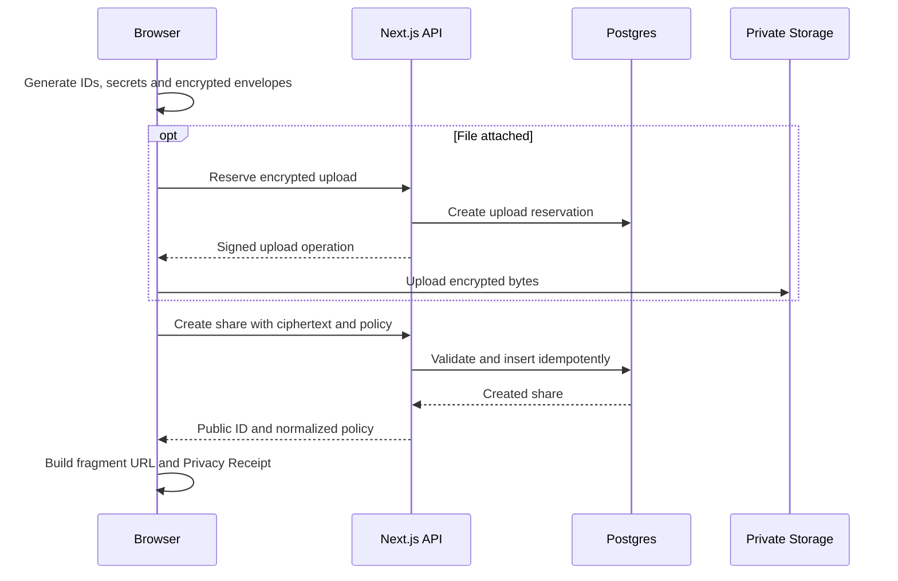
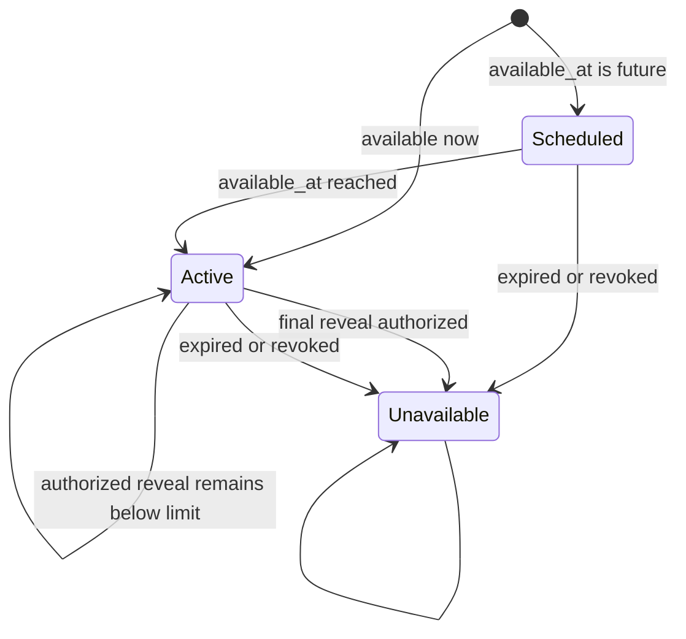

# SecureBin Architecture

## 1. Status and Goals

This document is the technical source of truth for the judged SecureBin release.
`info/plan.md` is a local, read-only source for product priorities and the
retained roadmap. When the two documents disagree, record the mismatch in
`info/HANDOFF.md` and update maintained technical documentation and code; never
edit or commit the plan.

### Current implementation status

The Day 1 plain-text path is implemented: browser encryption/decryption, strict
create/status/reveal/delete APIs, atomic reveal authorization, private database
boundaries, security headers, and automated unit/integration/browser/a11y
coverage. Password and two-channel factors, Markdown/code modes, attachment
routes, the Privacy Receipt, scheduled cleanup HTTP operation, and a verified
production deployment remain planned. Sections below define their intended
release contract and must not be read as evidence that they have shipped.

SecureBin provides anonymous, browser-encrypted sharing with server-enforced availability, expiry, revocation, and reveal limits. The server stores ciphertext and lifecycle metadata but never receives content keys, passwords, unlock codes, filenames, plaintext MIME types, or plaintext content.

The release boundary is intentionally narrow enough to harden thoroughly. Recipient-bound sharing, passkeys, Secure Rooms, encrypted discussions, richer previews, localization, Argon2id, size padding, alternate storage adapters, and SDKs remain compatible future phases.

## 2. Trust and Threat Model

### Trusted for a session

- The sender's current browser runtime and device.
- The recipient's current browser runtime and device.
- Web Crypto implementations supplied by supported browsers.

### Honest-but-curious infrastructure

- Next.js/Vercel server functions.
- Supabase Postgres, RPC, Storage, and scheduled jobs.
- Hosting and network logs.

Infrastructure is expected to enforce lifecycle policy correctly but is not trusted with plaintext. A malicious application deployment can replace browser JavaScript and capture plaintext or keys; zero-knowledge storage does not protect against that attack.

### Untrusted input

- All request bodies, headers, IDs, timestamps, ciphertext envelopes, Markdown, filenames, MIME declarations, and decrypted content.
- Secret URLs received from other people.
- Storage objects and database records read back by a client.

### Visible metadata

- Opaque public ID, creation/access timestamps, ciphertext size, selected lifecycle policy, request timing, and network metadata.
- Booleans indicating whether password or two-channel input is required so the viewer can prompt before consuming a reveal.

## 3. System Context



The browser owns key generation, derivation, encryption, decryption, content rendering, QR generation, and Privacy Receipt generation. The API owns validation, rate limiting, upload reservations, lifecycle policy, reveal leases, signed Storage operations, and redacted responses.

### Experience layer (non-authoritative)

The browser surface follows the quiet-proof direction in
[`docs/SPEC.md`](SPEC.md#experience-direction--quiet-proof): a light-first
Linen/Ink/Mineral/Copper palette, a single compose or reveal surface, and one
proofline connecting the browser, sealed parcel, and recipient. The proofline is
only an explanation of the client flow. It must never be used as evidence that
encryption, authorization, or deletion succeeded; those states come from the
actual local and API results and are written in accessible text.

Display, body, and receipt typography are bundled/self-hosted with system
fallbacks. Secret routes do not fetch remote fonts, media, analytics, or other
third-party assets. The visual direction avoids security theatre—neon effects,
terminal styling, fake threat meters, and shield/lock clichés—and does not
change the cryptographic or trust boundaries above.

## 4. Deployment Components

- **Next.js App Router:** public composer, share viewer, security page, and server-only route handlers.
- **Client crypto module:** Web Crypto wrappers, canonical encoding, envelopes, and golden-vector compatibility.
- **Supabase Postgres:** lifecycle metadata, ciphertext for textual content, upload reservations, reveal leases, and atomic functions.
- **Supabase Storage:** encrypted file bytes under random paths in a private bucket.
- **Supabase scheduled cleanup:** hourly database cleanup plus removal of associated private objects.
- **Vercel:** application deployment, nonce-based security headers, health endpoint, and sanitized logs.

The service-role credential is imported only from server-only modules. Browser code receives the public Supabase URL and anonymous key but does not receive direct table privileges.

## 5. Cryptographic Protocol v1

### Inputs

- `publicId`: 16 random bytes encoded as unpadded base64url, generated before encryption.
- `linkSecret`: 32 random bytes encoded in the URL fragment.
- `passwordMaterial`: optional 32-byte PBKDF2-HMAC-SHA-256 output.
- `unlockSecret`: optional 16-byte random value encoded with Crockford Base32 plus a check symbol.
- `passwordSalt`: optional 16-byte random PBKDF2 salt.
- `hkdfSalt`: 16-byte random HKDF salt shared by the content and file envelopes.
- `factorMask`: `link`, `link+password`, `link+unlock`, or `link+password+unlock`.

Password input is encoded as UTF-8 without Unicode normalization, limited to 1,024 bytes, and processed with a random 16-byte salt and exactly 600,000 PBKDF2 iterations in v1.

### Derivation

1. When enabled, derive `passwordMaterial` with PBKDF2-HMAC-SHA-256 using `passwordSalt` and 600,000 iterations.
2. Concatenate `linkSecret`, optional `passwordMaterial`, and optional `unlockSecret` in factor-mask order.
3. Derive independent 32-byte AES keys directly with HKDF-SHA-256 and `hkdfSalt`:
   - `securebin/v1/{factorMask}/content`
   - `securebin/v1/{factorMask}/file`
4. Future object types receive new labels; a label is never repurposed.

### Envelope

Each content or file envelope contains:

```text
version, objectType, algorithm, nonce, hkdfSalt, passwordSalt,
kdf, kdfParameters, factorMask, ciphertext
```

For v1, `kdf` describes password preprocessing, not the mandatory HKDF object-key derivation. It is `none` with the exact empty object `{}` when no password is present, and `PBKDF2-HMAC-SHA-256` with the exact object `{"iterations":600000}` when a password is present. `passwordSalt` is exactly `null` without a password and a 16-byte unpadded-base64url value with one. No other nullability or parameter shape is accepted.

AES-256-GCM uses a fresh random 12-byte nonce per envelope. Additional authenticated data is a canonical UTF-8 encoding of:

```text
securebin | version | publicId | objectType |
algorithm | kdf | kdfParameters | factorMask
```

Canonical encoding is `JSON.stringify` over a fixed-order array of validated primitive values; objects are not accepted in authenticated data. Golden fixtures lock the byte representation. Decryption rejects unknown versions, algorithms, object types, factor masks, nonce lengths, salts, parameters, fields, and oversized inputs before invoking Web Crypto.

The `kdfParameters` AAD slot is the validated compact JSON string for the supported parameter object: exactly `"{}"` or `"{\"iterations\":600000}"`. This preserves the primitive-only AAD rule while binding the full parameter set.

### URL and capabilities

- Viewer: `/s/{publicId}#{base64url(linkSecret)}`.
- The fragment remains in the address so refresh and copy-link behavior remain reliable. An explicit “hide key from address” action may remove it after warning that refresh will then require the original link.
- Two-channel unlock codes encode 128 random bits using Crockford Base32 groups and a check symbol.
- The deletion capability is 32 random bytes. Its SHA-256 digest is sent at creation; the raw capability is shown once and supplied only for deletion.

## 6. Data Model

### `shares`

| Field | Contract |
|---|---|
| `id` | Internal UUID primary key |
| `public_id` | Unique client-generated 128-bit opaque ID |
| `content_envelope` | Validated v1 metadata plus base64url ciphertext |
| `created_at` | Server UTC timestamp |
| `available_at` | Optional UTC start time |
| `expires_at` | Required UTC time, no more than 30 days after creation |
| `max_reveals` | Nullable positive integer in the supported preset set |
| `reveal_count` | Non-negative server-controlled counter |
| `revoked_at` | Nullable server UTC timestamp |
| `delete_token_hash` | 32-byte digest; never returned |
| `password_required` | Prompting metadata only |
| `unlock_required` | Prompting metadata only |
| `file_object_path` | Nullable random private Storage path |
| `file_envelope` | Nullable validated v1 metadata without bytes |
| `file_ciphertext_size` | Nullable bounded byte count |
| `idempotency_key_hash` | Unique digest for safe creation retry |

Database constraints enforce supported reveal limits, timestamp ordering, size bounds, non-negative counters, and `reveal_count <= max_reveals` when limited.

### `upload_reservations`

Stores a random object path, reservation-token digest, expected ciphertext size, creation/expiry time, attachment state, and optional share ID. Reservations expire after 15 minutes. Only an unexpired unattached reservation with the expected object size can be attached.

### `reveal_leases`

Stores share ID, reveal-request-token digest, creation time, and retry expiry. The unique pair `(share_id, request_token_hash)` makes reveal authorization idempotent for five minutes. Lease expiry removes retry privileges but never refunds a consumed reveal.

### `rate_limit_buckets`

Stores a server-HMACed network discriminator, action, fixed bucket start, count, and expiry. No raw IP address is persisted.

## 7. API Contracts

All APIs use strict shared schemas, size limits, JSON error codes, request IDs, and `Cache-Control: no-store`. Unknown fields are rejected.

### `POST /api/uploads`

Accept expected ciphertext size and file-envelope metadata. Return a reservation capability, random object path, and short-lived signed upload operation with overwrite disabled. Rate-limit before issuing a reservation. Before attachment, the server verifies the stored object's actual size against the reservation.

### `POST /api/shares`

Accept the client public ID, content envelope, lifecycle policy, deletion-token digest, idempotency-key digest, prompting flags, and optional raw upload-reservation capability. Hash and validate the capability without logging it, then attach the reservation transactionally. Return the public ID and normalized policy. Never accept plaintext content or file metadata.

### `GET /api/shares/:publicId/status`

Return one of:

- `active`: prompting flags, expiry, and approximate remaining reveals.
- `scheduled`: availability time and safe policy summary.
- `unavailable`: uniform state for missing, expired, exhausted, or revoked shares.

This endpoint never returns ciphertext and never consumes a reveal.

### `POST /api/shares/:publicId/reveal`

Accept a random reveal request token. An atomic RPC locks the share row and:

1. Returns authorization without increment when the same active lease exists.
2. Otherwise validates availability, expiry, revocation, and remaining reveals.
3. Increments the counter and inserts a five-minute lease in the same transaction.
4. Returns the content envelope and optional private object path to the server route.

The route returns ciphertext and, when applicable, a 60-second signed file URL. If signed URL generation or response delivery fails, retrying with the same token regenerates the response without another increment.

### `DELETE /api/shares/:publicId`

Accept the raw deletion capability, hash it server-side, compare it without logging, and set `revoked_at` atomically. Repeated valid deletion is idempotent. Object deletion happens asynchronously; revocation blocks new reveals immediately.

## 8. Primary Flows

### Create



### Reveal and retry

```mermaid
sequenceDiagram
    participant B as Recipient browser
    participant A as Next.js API
    participant D as Atomic RPC
    participant S as Private Storage
    B->>A: GET status
    A-->>B: active / scheduled / unavailable
    B->>B: Confirm limited reveal; create request token
    B->>A: POST reveal with request token
    A->>D: Authorize or reuse lease
    D-->>A: Ciphertext and optional object path
    opt File attached
        A->>S: Create 60-second signed URL
    end
    A-->>B: Encrypted envelopes
    B->>B: Derive keys, authenticate, decrypt, render safely
    opt Response lost
        B->>A: Retry with same request token
        A->>D: Reuse active lease; no increment
        A-->>B: Same authorization
    end
```

## 9. Policy State Machine



The public API deliberately collapses expired, exhausted, revoked, and missing records into `unavailable`. Owner-facing confirmation may acknowledge a valid deletion capability without changing recipient responses.

## 10. Rendering and Browser Security

### Product surface constraints

- Use one primary content surface and a compact evidence rail/status strip;
  layout changes must preserve the same semantic order on mobile.
- The proofline may animate once for a real local state transition, but it is
  decorative and explanatory. Copy and accessible state text remain present
  when motion is disabled or unavailable.
- Use plain, active labels for actions (`Create share`, `Reveal once`, `Copy
  link`) and a uniform recipient-facing `Unavailable` state. Do not expose
  hidden reasons through color, timing, animation, or visual labels.

- Render plain text with text nodes, never `innerHTML`.
- Parse Markdown with an established library, sanitize with an allowlist, strip remote images, and add `rel="noopener noreferrer"` to links.
- Syntax highlighting may emit only sanitizer-approved spans and classes.
- Preview only raster image formats decoded through Blob URLs and plain text rendered as text. Never inline SVG, HTML, or active documents.
- Revoke Blob URLs when views unmount.
- Use self-hosted fonts and assets. Secret routes load no third-party scripts, pixels, embeds, or remote media.
- Apply nonce-based CSP, HSTS, `Referrer-Policy: no-referrer`, `X-Content-Type-Options: nosniff`, restrictive Permissions Policy, frame denial, and `no-store`.

## 11. Reliability and Operations

- Creation and reveal are idempotent across retries and double-clicks.
- Database functions are the only path that changes reveal counters or lifecycle state.
- RLS denies direct anonymous table access; server routes use narrowly scoped operations.
- Cleanup runs hourly and is independently safe to retry.
- Structured logs include request ID, route, status class, latency, and coarse size bucket only.
- `/api/health` checks application availability without querying or revealing user data.
- Production smoke tests create, reveal, and delete a short-lived synthetic ciphertext record.

Reveal limits cannot prevent a recipient from copying already released ciphertext or plaintext. A response lost before the client receives its request token cannot be recovered, so the client creates and retains that token before making the request.

## 12. Architecture Decisions

- **ADR-001:** Next.js and Supabase minimize deployment risk and moving parts.
- **ADR-002:** Web Crypto AES-GCM, PBKDF2, and HKDF keep v1 browser-native; Argon2id remains a versioned future option.
- **ADR-003:** Fragment secrets prevent keys from reaching HTTP requests under normal browser behavior.
- **ADR-004:** Access policies are server-enforced availability controls, not DRM.
- **ADR-005:** Reveal leases trade a short retry window for correct idempotency and demo reliability.
- **ADR-006:** Files use private encrypted-object storage to avoid serverless body limits.
- **ADR-007:** Versioned envelopes and HKDF labels reserve clean extension points for recipient-bound sharing and Secure Rooms.

## 13. Required Verification

- Golden crypto vectors and tamper tests for every factor/object combination.
- SQL integration tests for constraints, RLS, idempotency, expiry, revocation, and cleanup.
- Concurrent final-reveal tests proving exact limits.
- Browser tests for creation, reveal, wrong factors, files, two-channel mode, mobile, keyboard, and failure recovery.
- Manual production smoke test plus automated lint, typecheck, unit, integration, E2E, accessibility, and build gates.
