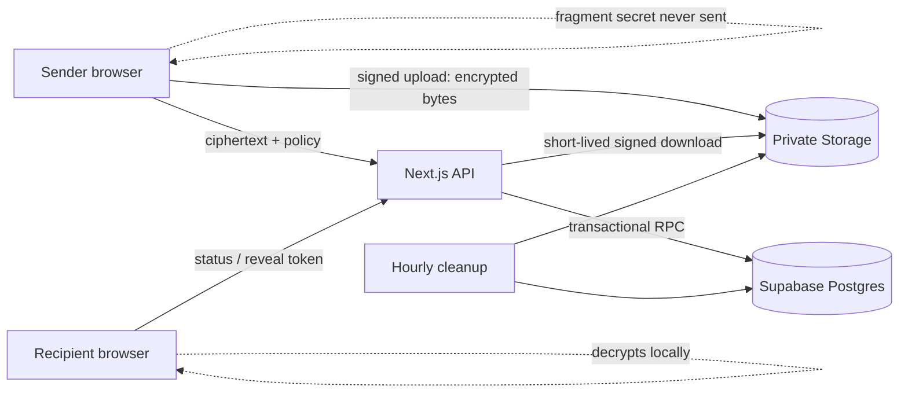
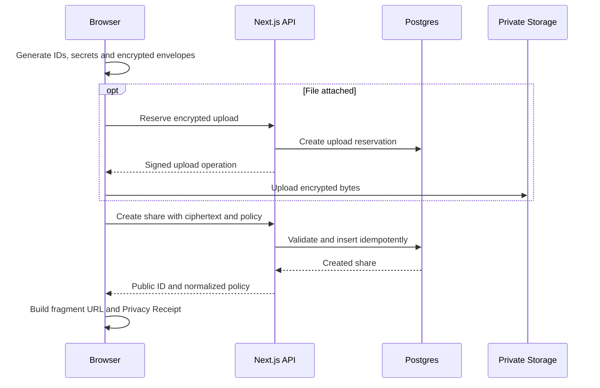
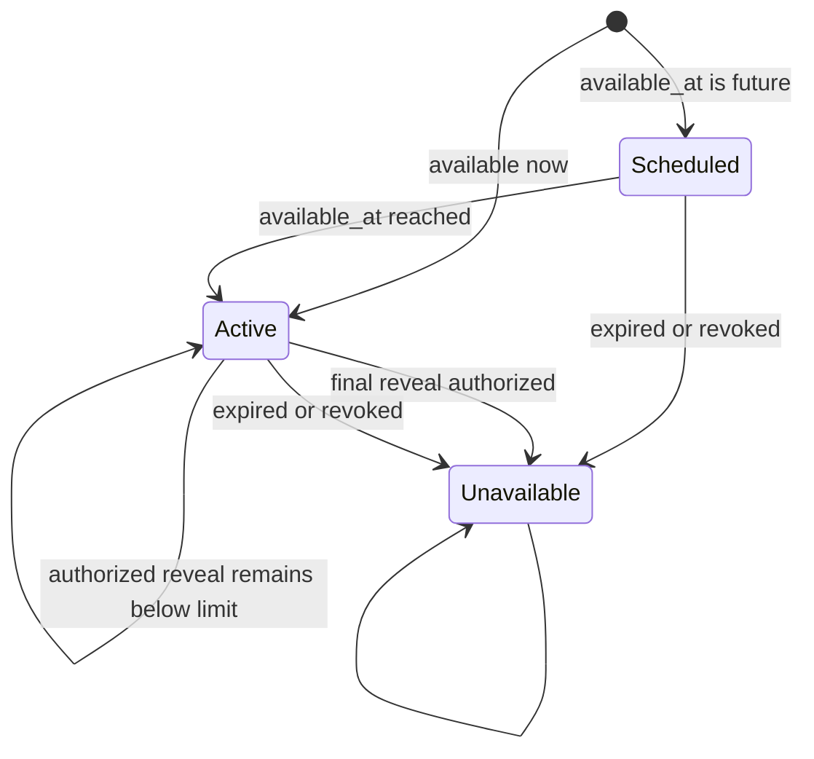

# SecureBin Architecture

## 1. Status and Goals

This document is the technical source of truth for the judged SecureBin release.
Validation evidence is maintained in `docs/evidence.md`.

### Released implementation

SecureBin is released on `main` and is available at
`https://secure-bin.vercel.app`. Its release gate passed lint, strict
typechecking, 217 unit tests, source audit, production build, clean Supabase
replay, pgTAP, environment-backed integration tests, development and
production browser tests, Axe checks, reproducibility, and dependency audits.
The hosted service uses the same reviewed application and database contract
documented here.

The current default theme is dark with an explicit light toggle; the rest of
the quiet-proof palette and route topology remain unchanged.

The application runs on Next.js 16 with the request proxy entry point in
`proxy.ts`. Node and pnpm remain pinned by the repository toolchain, and CI
runs independent release gates in parallel.

SecureBin provides anonymous, browser-encrypted sharing with server-enforced availability, expiry (including "Never"), revocation, and reveal limits from 1 to unlimited. The server stores ciphertext, a discussion-capability digest, and lifecycle metadata but never receives content keys, passwords, unlock codes, discussion capabilities, filenames, plaintext MIME types, or plaintext content.

The release boundary excludes recipient-bound sharing, passkeys, Secure Rooms, richer active previews, localization, Argon2id, size padding, alternate storage adapters, and SDKs.

## 2. Trust and Threat Model

### Trusted for a session

- The sender's current browser runtime and device.
- The recipient's current browser runtime and device.
- Web Crypto implementations supplied by supported browsers.

### Honest-but-curious infrastructure

- Next.js/Vercel server functions.
- Supabase Postgres, RPC, Storage, and scheduled jobs.
- Hosting and network logs.

Infrastructure is expected to enforce lifecycle policy correctly but is not trusted with plaintext. A malicious application deployment can replace browser JavaScript and capture plaintext or keys; zero-knowledge storage does not protect against that attack.

### Untrusted input

- All request bodies, headers, IDs, timestamps, ciphertext envelopes, Markdown, filenames, MIME declarations, and decrypted content.
- Secret URLs received from other people.
- Storage objects and database records read back by a client.

### Visible metadata

- Opaque public ID, creation/access timestamps, ciphertext size, selected lifecycle policy, request timing, and network metadata.
- Booleans indicating whether password or two-channel input is required so the viewer can prompt before consuming a reveal.

## 3. System Context



The browser owns key generation, derivation, encryption, decryption, content rendering, QR generation, and Privacy Receipt generation. The API owns validation, rate limiting, upload reservations, lifecycle policy, reveal leases, signed Storage operations, and redacted responses.

### Experience layer (non-authoritative)

The browser surface follows the quiet-proof direction: a dark-first theme with
a light toggle, a single compose or reveal surface, and one
proofline connecting the browser, sealed parcel, and recipient. The proofline is
only an explanation of the client flow. It must never be used as evidence that
encryption, authorization, or deletion succeeded; those states come from the
actual local and API results and are written in accessible text.

Typography currently ships as a deliberate system-font stack (the CSS names
its intended display/body/receipt faces; no webfont files are bundled yet).
Secret routes do not fetch remote fonts, media, analytics, or other
third-party assets. The visual direction avoids security theatre—neon effects,
terminal styling, fake threat meters, and shield/lock clichés—and does not
change the cryptographic or trust boundaries above.

## 4. Deployment Components

- **Next.js App Router:** public landing (`/`), sharing app (`/new`), share viewer, and server-only route handlers.
- **Client crypto module:** Web Crypto wrappers, canonical encoding, envelopes, and golden-vector compatibility.
- **Supabase Postgres:** lifecycle metadata, ciphertext for textual content, upload reservations, reveal leases, and atomic functions.
- **Supabase Storage:** encrypted file bytes under random paths in a private bucket.
- **Supabase scheduled cleanup:** hourly database cleanup plus removal of associated private objects.
- **Vercel:** application deployment, nonce-based security headers, health endpoint, and sanitized logs.

The service-role credential is imported only from server-only modules. Browser code never talks to Supabase directly: it exchanges ciphertext only with this application's API and, for attachments, with pre-signed Storage URLs. No anonymous key ships in any bundle.

## 5. Cryptographic Protocol v1

### Inputs

- `publicId`: 16 random bytes encoded as unpadded base64url, generated before encryption.
- `linkSecret`: 32 random bytes encoded in the URL fragment.
- `passwordKey`: optional 32-byte PBKDF2-HMAC-SHA-256 output.
- `unlockSecret`: optional 124-bit random value encoded as exactly 27 characters with the canonical base-28 alphabet and check symbol defined below.
- `passwordSalt`: optional 16-byte random PBKDF2 salt.
- `hkdfSalt`: 16-byte random HKDF salt shared by the content and file envelopes.
- `factorMask`: `link`, `link+password`, `link+unlock`, or `link+password+unlock`.

Password input is encoded as UTF-8 without Unicode normalization, limited to 1,024 bytes, and processed with a random 16-byte salt and exactly 600,000 PBKDF2 iterations in v1.

### Derivation

1. When enabled, derive `passwordKey` with PBKDF2-HMAC-SHA-256 using the 16-byte `passwordSalt` and exactly 600,000 iterations; the result is a 32-byte key.
2. Build the HKDF input keying material by concatenation in factor-mask order: `linkSecret` (32 bytes) ‖ `passwordKey` (32 bytes, only when the mask includes password) ‖ `unlockBytes` (16 bytes, only when the mask includes unlock). The raw password and the printable unlock code are never used as HKDF input directly.
3. Derive independent 32-byte AES keys from that IKM with HKDF-SHA-256 and `hkdfSalt`, using labels per envelope version:
   - v1: `securebin/v1/{factorMask}/content` and `/file`
   - v2: `securebin/v2/link/content` and `securebin/v2/link/file` for every factor mask. Optional factor material remains in the IKM and the factor mask remains authenticated in AAD; deployed labels never vary by mask.
   - Discussions (v2 only): `securebin/v2/{factorMask}/discussion`, derived from the raw 32-byte discussion capability instead of the share IKM, with the comment thread's own random HKDF salt.
4. Future object types receive new labels; a label is never repurposed.

### Unlock code format

Two-channel unlock codes carry 124 random bits as 26 canonical base-28 body characters plus one checksum character — exactly 27 uppercase characters total. Separators, whitespace, lowercase, ambiguous aliases, non-canonical body digits, and wrong checksums are rejected before network access. Only the decoded 16 bytes enter key derivation.

### Envelope

Each content or file envelope contains:

```text
version, objectType, algorithm, nonce, hkdfSalt, passwordSalt,
kdf, kdfParameters, factorMask, ciphertext
```

For v1, `kdf` describes password preprocessing, not the mandatory HKDF object-key derivation. It is `none` with the exact empty object `{}` when no password is present, and `PBKDF2-HMAC-SHA-256` with the exact object `{"iterations":600000}` when a password is present. `passwordSalt` is exactly `null` without a password and a 16-byte unpadded-base64url value with one. No other nullability or parameter shape is accepted.

AES-256-GCM uses a fresh random 12-byte nonce per envelope. Additional authenticated data is a canonical UTF-8 encoding of:

```text
securebin | version | publicId | objectType |
algorithm | kdf | kdfParameters | factorMask
```

Canonical encoding is `JSON.stringify` over a fixed-order array of validated primitive values; objects are not accepted in authenticated data. Golden fixtures lock the byte representation. Decryption rejects unknown versions, algorithms, object types, factor masks, nonce lengths, salts, parameters, fields, and oversized inputs before invoking Web Crypto.

The `kdfParameters` AAD slot is the validated compact JSON string for the supported parameter object: exactly `"{}"` or `"{\"iterations\":600000}"`. This preserves the primitive-only AAD rule while binding the full parameter set.

### Day 3 protocol v2 decision

Version 1 content remains the shipped legacy whole-note plaintext format; a v1 file envelope is invalid. Version 2 content and file envelopes retain the same exact field names and AES-GCM/AAD construction and use the fixed deployed `securebin/v2/link/content` and `securebin/v2/link/file` HKDF labels for all factor masks.

#### Content Envelope v2 Framing (Magic `SBCT`)

Version 2 content plaintext is canonically framed as:
- 4 bytes ASCII magic `SBCT` (`0x53, 0x42, 0x43, 0x54`)
- 1 byte payload version `0x01`
- 1 byte mode: `0x00` (note), `0x01` (markdown), `0x02` (code)
- 1 byte language ID:
  - `0`: plaintext (also for note / markdown)
  - `1`: javascript, `2`: typescript, `3`: json, `4`: python, `5`: bash, `6`: sql, `7`: css, `8`: html
- 4 bytes unsigned big-endian UTF-8 text length
- N bytes UTF-8 text, with no trailing bytes

Legacy detection uses the authenticated envelope version: version 1 decodes its entire plaintext as a legacy note even when it starts with `SBCT`; version 2 requires valid `SBCT` framing. Unknown envelope versions are rejected before invoking Web Crypto.

#### Content Payload v2 Discussion Trailer (payload version 0x02)

A v2 content payload whose SBCT payload version byte is `0x02` appends a fixed 32-byte encrypted-discussion capability block after the framed text. The trailer carries the raw discussion capability sealed inside the already-encrypted share, so a recipient learns it only after successful local decryption and the public ID alone can never list or post comments. Payload version `0x01` remains valid without a trailer; any other value is rejected.

#### File Envelope v2 Framing

Version 2 file plaintext is canonically framed as:
- 4 bytes unsigned big-endian filename UTF-8 length (`uint32`)
- 2 bytes unsigned big-endian MIME UTF-8 length (`uint16`)
- N bytes filename UTF-8 (max 512 bytes)
- M bytes MIME UTF-8 (max 128 bytes)
- K bytes original file plaintext bytes (max 10,485,760 bytes / 10 MiB)

#### Locked Size Bounds

- `MAX_FILE_PLAINTEXT_BYTES = 10_485_760`
- `MAX_FILENAME_BYTES = 512`
- `MAX_MIME_BYTES = 128`
- `FILE_HEADER_BYTES = 6`
- `GCM_TAG_BYTES = 16`
- `MAX_FILE_CIPHERTEXT_SIZE = 10_486_422` (10,485,760 + 512 + 128 + 6 + 16)
- `MAX_CONTENT_BYTES = 524_288` (512 KiB)
- `MAX_CONTENT_CIPHERTEXT_BYTES_V1 = 524_304` (524,288 + 16)
- `MAX_CONTENT_CIPHERTEXT_CHARS_V1 = 699_072`
- `MAX_CONTENT_CIPHERTEXT_BYTES_V2 = 524_315` (524,288 + 11 + 16)
- `MAX_CONTENT_CIPHERTEXT_CHARS_V2 = 699_087`

A new forward migration replaces SQL validation and size constraints atomically with browser/API parsers and golden vectors.

### URL and capabilities

- Viewer: `/s/{publicId}#{base64url(linkSecret)}`.
- The fragment remains in the address so refresh and copy-link behavior remain reliable. An explicit “hide key from address” action may remove it after warning that refresh will then require the original link.
- Two-channel unlock codes use the canonical 27-character base-28 format specified under "Unlock code format" above.
- The deletion capability is 32 random bytes. Its SHA-256 digest is sent at creation; the raw capability is shown once and supplied only for deletion.

## 6. Data Model

### `shares`

| Field | Contract |
|---|---|
| `id` | Internal UUID primary key |
| `public_id` | Unique client-generated 128-bit opaque ID |
| `content_envelope` | Validated v1 legacy-content or v2 framed-content envelope with base64url ciphertext |
| `created_at` | Server UTC timestamp |
| `available_at` | Optional UTC start time |
| `expires_at` | Nullable UTC time, no more than 30 days after creation when set; `NULL` means "Never" — the share never expires but stays revocable |
| `max_reveals` | Nullable integer between 1 and 100; `NULL` means unlimited |
| `reveal_count` | Non-negative server-controlled counter |
| `revoked_at` | Nullable server UTC timestamp |
| `delete_token_hash` | 32-byte digest; never returned |
| `password_required` | Prompting metadata only |
| `unlock_required` | Prompting metadata only |
| `discussion_capability_hash` | Nullable SHA-256 digest of the discussion capability; `NULL` disables threads |
| `idempotency_key_hash` | Unique digest for safe creation retry |

Database constraints enforce reveal limits (`max_reveals is null or max_reveals between 1 and 100`), timestamp ordering (`expires_at is null or expires_at > created_at`), size bounds, non-negative counters, and `reveal_count <= max_reveals` when limited. Envelope fields are validated in SQL by `securebin_valid_envelope` and its `securebin_b64url` / `securebin_b64url_range` helpers, whose canonical base64url comparison is newline-tolerant (forward migration `20260825000000`) because Postgres `encode(bytea,'base64')` wraps output every 76 characters.

### `share_attachments`

The Day 3 single-file triple (`file_object_path`, `file_envelope`, `file_ciphertext_size`) on `shares` was replaced by this child table in forward migration `20260828000000_multi_file_attachments.sql`. Each row holds the share ID, an `attachment_slot` (0–4, unique per share), a random private Storage object path, a metadata-only v2 file envelope, and the bounded ciphertext size. Legacy single-file rows were migrated into slot 0 and the old columns dropped. Reservations gain the same slot column with the tuple uniqueness `(reserved_public_id, idempotency_key_hash, attachment_slot)`, which supersedes the Day-2 pair constraint.

### `share_comments`

Encrypted discussion thread table (forward migrations `20260829000000_encrypted_discussions.sql` and `20260830000000_discussion_comment_edit_delete.sql`). Each row stores the share ID, an optional parent comment UUID for one-level replies, the pre-encrypted body envelope (≤4096 bytes), an optional encrypted nickname envelope (≤1024 bytes), the SHA-256 digest of a client-held edit proof token, and the server creation time. Edits replace the body envelope and set `edited_at` only when the raw token hashes to the stored digest; deletion hard-removes the row so replies to it survive as orphans rendered as "[comment removed]". Lifecycle is inherited from the parent share — revoked, expired, reveal-exhausted, or scheduled shares raise a uniform discussion-unavailable rejection for listing, posting, editing, and deleting; rows are removed with the share by scheduled cleanup.

### `upload_reservations`

Stores a random object path, future public ID, idempotency digest, metadata-only file envelope, expected ciphertext size, creation/expiry time, attachment state, and optional share ID. Reservations expire after 15 minutes. Only the unexpired unattached reservation matching the complete future-share tuple and actual object size can be attached. No separate attachment capability exists. When an expired unattached tuple is retried, the RPC rotates to a fresh path and transactionally records the old path in the private forced-RLS `upload_rotation_cleanup_queue`.

### `reveal_leases`

Stores share ID, reveal-request-token digest, creation time, and retry expiry. The unique pair `(share_id, request_token_hash)` makes reveal authorization idempotent for five minutes. Lease expiry removes retry privileges but never refunds a consumed reveal.

### `rate_limit_buckets`

Stores a server-HMACed network discriminator, action, fixed bucket start, count, and expiry. No raw IP address is persisted.

## 7. API Contracts

All APIs use strict shared schemas, size limits, JSON error codes, request IDs, and `Cache-Control: no-store`. Unknown fields are rejected.

Supabase SQLSTATE `22023` validation failures surface from PostgREST as `400`;
the server dependency boundary deliberately maps them to a uniform public
failure. Diagnostics may compare field names/types and decoded lengths, never
envelope values or ciphertext.

### `POST /api/uploads`

Accept the future share public ID, idempotency digest, metadata-only file envelope, expected ciphertext size, and an `attachmentSlot` from 0 to 4 (0 for single-file shares). Store a reservation bound to that exact tuple and return a random object path plus a signed upload operation with overwrite disabled. No attachment bearer capability is created or sent. Rate-limit before issuing a reservation. Before attachment, verify the stored object's actual size; the 15-minute reservation expiry remains the server authorization boundary.

The replacement RPC is `create_upload_reservation(text, bytea, jsonb, bigint, integer)` for public ID, idempotency digest, exact metadata-only file envelope, size, and slot. The table uniquely binds `(reserved_public_id, idempotency_key_hash, attachment_slot)`. An identical live retry reuses the path and receives a fresh signed operation; changed envelope/size returns `409 reservation_conflict`; an expired unattached tuple is reinitialized with a fresh path while its old path is queued for cleanup; attached tuples cannot be uploaded again. File envelopes reject `ciphertext` and unknown fields. Cleanup removes abandoned reservation paths and queued rotation paths through Storage first, then finalizes only successful or already-missing objects.

Cleanup uses exactly two service-role RPCs: `list_cleanup_candidates()` returns validated candidates (`share`, `upload`, `upload_rotation`), and `finalize_expired_securebin(uuid[], uuid[], uuid[])` is the single finalizer signature — the earlier two-array overload was dropped by forward migration `20260824000000` because ambiguous PostgREST overload resolution broke named-argument calls. Share candidates may have a null object path for note-only shares. Expired, revoked, and exhausted shares are eligible; exhausted shares wait until their five-minute retry leases have closed so a lost response can still be recovered. All three parameters are accepted explicitly; absent groups are passed as SQL `NULL`. This behavior is implemented by forward migration `20260902000000_exhausted_share_cleanup.sql`.

### `POST /api/shares`

Accept the client public ID, content envelope (optionally carrying the SBCT `0x02` discussion trailer), lifecycle policy (`expires_at` may be `null` for "Never"; `max_reveals` is an integer from 1 to 100 or null for unlimited), deletion-token digest, idempotency-key digest, prompting flags, and the optional SHA-256 digest of the discussion capability. Find and lock the unexpired unattached reservations matching public ID, idempotency digest, file envelope, size, and slots; verify and attach transactionally. Return the public ID and normalized policy. Never accept an upload-reservation capability, plaintext content, file metadata, or a raw discussion capability — only its digest.

The replacement RPC is the 11-argument `create_share(text, jsonb, timestamptz, timestamptz, integer, bytea, boolean, boolean, bytea, bytea, integer)` in public-ID-through-reveal-window order (forward migration `20260831000000`; earlier overloads are dropped and revoked). The trailing `p_reveal_window_seconds` is null or an integer from 10 to 86 400. An idempotency-key retry whose immutable request differs — including a different window — returns HTTP `409` with exactly `{"error":"idempotency_conflict"}` and no original ID, envelope, policy, or capability.

### Reveal window

A sender may cap the span between the first and last ciphertext release (`none | 10s | 30s | 1m | 5m | custom ≤ 24h`). The window starts atomically inside `reveal_share` at the first successful authorization: that transaction stamps `first_released_at` and `window_ends_at`. Once `window_ends_at` has passed, new request tokens receive the uniform unavailable path; the original token keeps its normal five-minute retry-lease semantics (it re-mints the SAME release). The reveal response carries `releaseWindowEndsAt` so recipients see an honest closing time; SecureBin claims no power over copies already saved.

### `GET /api/shares/:publicId/status`

Return one of:

- `active`: prompting flags, expiry, and approximate remaining reveals.
- `scheduled`: availability time and safe policy summary.
- `unavailable`: uniform state for missing, expired, exhausted, or revoked shares.

This endpoint never returns ciphertext and never consumes a reveal.

### `POST /api/shares/:publicId/reveal`

Accept a random reveal request token. An atomic RPC locks the share row and:

1. Returns authorization without increment when the same active lease exists.
2. Otherwise validates availability, expiry, revocation, and remaining reveals.
3. Increments the counter and inserts a five-minute lease in the same transaction.
4. Returns the content envelope and optional private object path to the server route.

The route returns the content envelope and, when attachments exist, a `files` array — one entry per slot with `{ slot, envelope, ciphertextSize, downloadUrl }`, each download URL signed for 60 seconds. If signed URL generation or response delivery fails, retrying with the same token regenerates the response without another increment. Known limitation: the reveal lease is consumed by the RPC before the server generates the signed URLs, so a recipient who abandons the attempt and returns after the 5-minute lease window has expired consumes a second authorization on the next attempt.

### `POST /api/shares/status-batch`

Accept up to 50 public IDs (`MAX_STATUS_BATCH_IDS`) and return one status row per ID using the same active/scheduled/unavailable classification as the single-status endpoint. Backed by the service-definer RPC `get_share_status_batch(text[])`; unavailable rows are returned uniformly so callers cannot distinguish missing from revoked. Rate-limited under the same `status` bucket family as single-status reads. This endpoint never returns ciphertext and never consumes a reveal.

### `GET /api/shares/:publicId/comments`

List a share's encrypted discussion thread. The raw discussion capability travels in the `x-discussion-capability` request header (kept out of proxy and access logs); it is hashed server-side and compared against the stored digest. The atomic function enforces lifecycle inheritance first: revoked, expired, reveal-exhausted, or scheduled shares are rejected uniformly before any comment row is read. Returns comment rows (id, parent id, encrypted envelopes, timestamps) in ascending order; never plaintext.

### `POST /api/shares/:publicId/comments`

Accept the raw discussion capability, an optional parent comment UUID, the pre-encrypted body envelope, and optional encrypted nickname envelope. The RPC re-checks lifecycle inheritance, verifies the capability digest against the share's stored digest, rate-limits per share (`discussion/{share_id}` discriminator, 60 per minute), and inserts append-only. Route-level buckets also apply to both endpoints via the HMACed network discriminator: 120 requests per fixed window for GET and 30 for POST. Comment bodies arrive only as ciphertext; no plaintext or capability value is logged.

### `PATCH|DELETE /api/shares/:publicId/comments/:commentId`

Edit and delete a comment using its random client-held proof token. The client sends the raw discussion capability plus the raw proof token; both are hashed server-side and compared against the stored digests without logging. The atomic RPCs re-check lifecycle inheritance before touching any row. A successful edit replaces the body envelope and sets `edited_at`; a successful delete hard-removes the row, leaving replies in place as orphans. Wrong tokens return the same rejection for every failure shape. The raw token exists only in the author's browser storage; losing it makes the comment permanently read-only.

### `DELETE /api/shares/:publicId`

Accept the raw deletion capability, hash it server-side, compare it without logging, and set `revoked_at` atomically. Repeated valid deletion is idempotent. Object deletion happens asynchronously; revocation blocks new reveals immediately.

## 8. Primary Flows

### Create



### Reveal and retry

```mermaid
sequenceDiagram
    participant B as Recipient browser
    participant A as Next.js API
    participant D as Atomic RPC
    participant S as Private Storage
    B->>A: GET status
    A-->>B: active / scheduled / unavailable
    B->>B: Confirm limited reveal; create request token
    B->>A: POST reveal with request token
    A->>D: Authorize or reuse lease
    D-->>A: Ciphertext and optional object path
    opt File attached
        A->>S: Create 60-second signed URL
    end
    A-->>B: Encrypted envelopes
    B->>B: Derive keys, authenticate, decrypt, render safely
    opt Response lost
        B->>A: Retry with same request token
        A->>D: Reuse active lease; no increment
        A-->>B: Same authorization
    end
```

## 9. Policy State Machine

A sender-chosen **release window** adds one edge: an active share with remaining reveals becomes effectively unavailable once `window_ends_at` (stamped at first release) passes; the original request token keeps its five-minute retry lease.



The public API deliberately collapses expired, exhausted, revoked, and missing records into `unavailable`. Owner-facing confirmation may acknowledge a valid deletion capability without changing recipient responses.

## 10. Rendering and Browser Security

### Product surface constraints

- Use one primary content surface and a compact evidence rail/status strip;
  layout changes must preserve the same semantic order on mobile.
- The proofline may animate once for a real local state transition, but it is
  decorative and explanatory. Copy and accessible state text remain present
  when motion is disabled or unavailable.
- Use plain, active labels for actions (`Create share`, `Reveal once`, `Copy
  link`) and a uniform recipient-facing `Unavailable` state. Do not expose
  hidden reasons through color, timing, animation, or visual labels.

- Render plain text with text nodes, never `innerHTML`.
- Parse Markdown with an established library, sanitize with an allowlist, strip remote images, and add `rel="noopener noreferrer"` to links.
- Syntax highlighting uses browser-only `lowlight@3.3.0` with language IDs `0–20`; IDs `9–20` are append-only and older clients reject unknown IDs. Conservative, debounced Code-mode detection and the accessible overlay editor are implemented. Its HAST is rebuilt as React from only text/root and `span` nodes with allowlisted `hljs-*` classes; any other node/property falls back to plaintext.
- Server-only `@supabase/supabase-js@2.50.0` implements signed private Storage operations so credential/header details are not reimplemented. It is instantiated only in server modules with session persistence and refresh disabled; the dependency is advisory-checked before installation.
- Preview only raster image formats decoded through Blob URLs and plain text rendered as text. Never inline SVG, HTML, or active documents.
- Revoke Blob URLs when views unmount, before replacing an existing URL, and immediately after a download click completes.
- Use self-hosted fonts and assets. Secret routes load no third-party scripts, pixels, embeds, or remote media.
- Apply nonce-based CSP, HSTS, `Referrer-Policy: no-referrer`, `X-Content-Type-Options: nosniff`, restrictive Permissions Policy, frame denial, and `no-store`.
- The CSP `connect-src` list is `'self'` plus exactly one configured origin: the Supabase project URL (`NEXT_PUBLIC_SUPABASE_URL` / `SUPABASE_URL`), because the browser uploads ciphertext to and downloads attachments from Storage via short-lived signed URLs. No other cross-origin connection is permitted; an unset or malformed URL leaves `connect-src 'self'`.

## 11. Reliability and Operations

- Creation and reveal are idempotent across retries and double-clicks.
- Database functions are the only path that changes reveal counters or lifecycle state.
- RLS denies direct anonymous table access; server routes use narrowly scoped operations.
- Cleanup runs hourly and is independently safe to retry.
- Structured logs include request ID, route, status class, latency, and coarse size bucket only.
- `/api/health` checks application availability without querying or revealing user data.
- Production smoke tests create, reveal, and delete a short-lived synthetic ciphertext record.

Reveal limits cannot prevent a recipient from copying already released ciphertext or plaintext. A response lost before the client receives its request token cannot be recovered, so the client creates and retains that token before making the request.

## 12. Architecture Decisions

- **ADR-001:** Next.js and Supabase minimize deployment risk and moving parts.
- **ADR-002:** Web Crypto AES-GCM, PBKDF2, and HKDF keep v1 browser-native; Argon2id remains a versioned future option.
- **ADR-003:** Fragment secrets prevent keys from reaching HTTP requests under normal browser behavior.
- **ADR-004:** Access policies are server-enforced availability controls, not DRM.
- **ADR-005:** Reveal leases trade a short retry window for correct idempotency and demo reliability.
- **ADR-006:** Files use private encrypted-object storage to avoid serverless body limits.
- **ADR-007:** Versioned envelopes and HKDF labels reserve clean extension points for recipient-bound sharing and Secure Rooms.
- **ADR-008:** Discussions use a capability-digest model — only the SHA-256 of a random 32-byte capability is stored; the raw value is sealed inside the encrypted share and re-presented per request, so infrastructure can neither read threads nor grant access.

## 13. Required Verification

- Golden crypto vectors and tamper tests for every factor/object combination, including all four factor masks, discussion envelopes, and wrong-capability rejection.
- SQL integration tests for constraints, RLS, idempotency, expiry (including `NULL` "Never"), revocation, cleanup, attachment slots, and comment size bounds.
- Concurrent final-reveal tests proving exact limits, including custom non-preset limits (e.g., exactly 7 of M authorized).
- Browser tests for creation, reveal, wrong factors, single- and multi-file attachments, ZIP download, discussions, two-channel mode, mobile, keyboard, and failure recovery.
- Manual production smoke test plus automated lint, typecheck, unit, integration, E2E, accessibility, and build gates.

## 14. Residual-risk register

| Threat | Control | Residual risk |
| --- | --- | --- |
| Curious database/storage operator | Browser encryption; private random object paths | Size, timing, lifecycle policy, and access patterns remain visible. |
| Stolen link fragment | Optional password and separately delivered unlock factor | A complete factor set authorizes local decryption. |
| Replay/racing reveals | Row-locked atomic RPC and request-token lease | Authorization cannot prevent copying after release. |
| Malicious content | Strict frames, Markdown sanitization, allowlisted syntax tree, safe previews | Downloaded files may be unsafe in external applications. |
| Compromised application/browser/device | CSP, no remote assets on secret routes, reviewed Web Crypto boundary | Runtime compromise can capture plaintext and keys. |
| Logs and diagnostics | Redacted structured logging and no-store responses | Provider network metadata remains visible. |

The lifecycle and sequence sections above replace the former standalone diagram, threat-model, and policy-state documents. Release-window semantics are contractual: revocation and expiry override retry leases immediately; the same authorized token may retry across reveal exhaustion or window closure only during its five-minute lease. The forward lifecycle migrations and regression suite enforce this contract in the reviewed release source; hosted application of those migrations remains an owner check.
