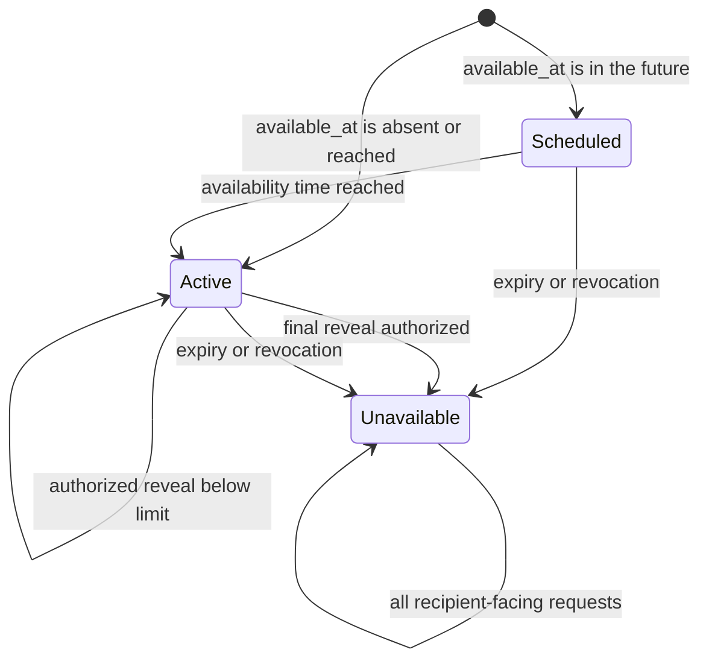

# SecureBin policy state

The lifecycle state is enforced server-side in a transaction. The public
recipient API deliberately collapses missing, expired, exhausted, and revoked
records into `unavailable`. `reveal_count` changes only through the atomic
reveal function; a retry with the same active request token reuses its lease.

## Transition rules

| Transition | Authoritative check | Observable recipient state |
| --- | --- | --- |
| create → scheduled/active | Valid envelope, policy, timestamps, capability digests, and idempotency key | Share URL and safe policy summary |
| scheduled → active | Current UTC time is at or after `available_at` | `active` |
| active → active | Reveal lease exists, or remaining count is positive/unlimited | Ciphertext release (after confirmation for limited shares) |
| active → unavailable | Expired, revoked, or final reveal lease committed | `unavailable` |
| any lookup → unavailable | Missing, expired, exhausted, or revoked | Same `unavailable` response |
| delete → unavailable | Valid deletion capability atomically sets `revoked_at` | Same `unavailable` response |

The server authorizes a ciphertext release, not successful decryption or human
viewing. A response that is lost can be retried with its same request token
within the lease window without consuming another reveal.

## Custom limits and "Never" expiry

`max_reveals` accepts any integer from 1 to 100 (`max_reveals is null or max_reveals between 1 and 100`); `NULL` remains unlimited. The same atomic lease path enforces custom limits, so a non-preset limit behaves identically under concurrency.

`expires_at` is nullable (`expires_at is null or expires_at > created_at`). `NULL` means "Never": the share never expires but stays revocable through its deletion capability at any time. Unlimited reveals and "Never" expiry remain independent choices — either can be set without the other.

## Discussion lifecycle inheritance

Encrypted discussions inherit the parent share's lifecycle inside the same atomic database functions that gate listing and posting:

- Revoked, expired, reveal-exhausted, and scheduled shares reject both comment reads and writes with a uniform unavailable rejection — no thread content or existence signal escapes after the share closes.
- A valid discussion capability digest is required in addition to the lifecycle check; public-ID-only access can never enumerate a thread.
- Comment bodies are replaced only by proof-token-gated edits (`edited_at` is set), and proof-token-gated deletes hard-remove the row; replies to deleted comments remain as orphans. Rows are removed with the share by the scheduled cleanup path.

## Current evidence boundary

The Day 2 concurrency matrix and every policy added through Day 5 are **verified** by the pgTAP suite (8 files, 131 tests) and integration tests:
- 20 concurrent requests on a `max_reveals = 1` share: exactly 1 authorized (winner lease), 19 uniform `unavailable`.
- 20 concurrent requests on a `max_reveals = 3` share: exactly 3 authorized, 17 uniform `unavailable`.
- Custom-limit concurrency: exactly N of M authorized at a non-preset limit.
- Same-token retry within the 5-minute lease window successfully re-authorizes without incrementing the reveal counter.
- Concurrent reveal vs. revoke settled safely with subsequent requests returning uniform `unavailable`.
- Real `anon` and `authenticated` PostgreSQL roles confirmed denied direct access to all tables — including `share_attachments` and `share_comments` — Storage bucket objects, and lifecycle RPCs.
- Custom expiration (between 1 hour and 30 days), "Never" (`NULL`) expiry with revocation, custom reveal counts 1–100, and discussion lifecycle gating are validated across client, API schemas, and Postgres constraints.
