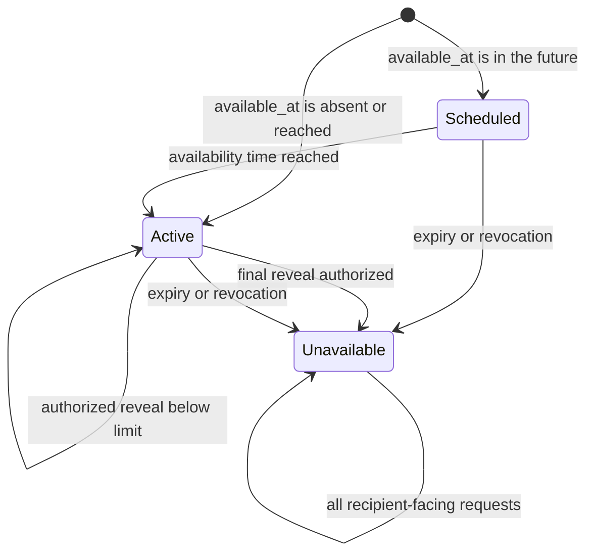

# SecureBin policy state

The lifecycle state is enforced server-side in a transaction. The public
recipient API deliberately collapses missing, expired, exhausted, and revoked
records into `unavailable`. `reveal_count` changes only through the atomic
reveal function; a retry with the same active request token reuses its lease.

## Transition rules

| Transition | Authoritative check | Observable recipient state |
| --- | --- | --- |
| create → scheduled/active | Valid envelope, policy, timestamps, capability digests, and idempotency key | Share URL and safe policy summary |
| scheduled → active | Current UTC time is at or after `available_at` | `active` |
| active → active | Reveal lease exists, or remaining count is positive/unlimited | Ciphertext release (after confirmation for limited shares) |
| active → unavailable | Expired, revoked, or final reveal lease committed | `unavailable` |
| any lookup → unavailable | Missing, expired, exhausted, or revoked | Same `unavailable` response |
| delete → unavailable | Valid deletion capability atomically sets `revoked_at` | Same `unavailable` response |

The server authorizes a ciphertext release, not successful decryption or human
viewing. A response that is lost can be retried with its same request token
within the lease window without consuming another reveal.

## Current evidence boundary

The Day 1 implementation exercises active, limited-reveal, idempotent retry,
revocation/deletion, expiry, and the uniform unavailable response through the
database and test suites. The broader Day 2 concurrency matrix and a real
production-backed policy run remain required before claiming the entire
lifecycle milestone. Hand off an exact commit and test results; never use a
deployed share URL as test documentation because its fragment is secret.
